# StudentsManagement_MicroServices
Full-stack microservices application for managing students and addresses using Spring Boot, Spring Cloud (Eureka, OpenFeign), API Gateway, and Angular

# 🎓 Student Management Microservices System

A full-stack microservices application for managing students and addresses using Spring Boot, Spring Cloud (Eureka, OpenFeign), API Gateway, and Angular.

---

## 📌 Overview

This project demonstrates a distributed microservices architecture where:

- Students and Addresses are managed in separate microservices
- Services are registered using Eureka
- API Gateway routes external requests
- OpenFeign enables inter-service communication
- Angular provides a modern UI with pagination and dialogs

---

## 🏗️ System Architecture Diagram

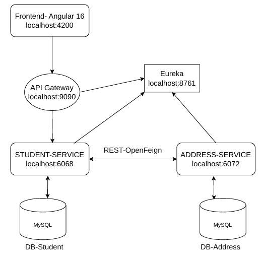

---

## 🛠️ Technologies Used

### Backend
- Java 17
- Spring Boot
- Spring Cloud
- Eureka Server
- OpenFeign
- API Gateway
- MySQL
- Maven

### Frontend
- Angular
- Angular Material
- Bootstrap

---

## 🚀 Features

### 👨‍🎓 Student Service
- Create Student
- Update Student
- Delete Student
- Get All Students (with address info)
- Pagination
- Filtering

### 🏠 Address Service
- Create Address
- Update Address
- Delete Address
- Get Address by ID
- Pagination
- Filtering

### 🌐 System
- Service Discovery with Eureka
- Inter-service communication via Feign
- Confirmation dialogs before deletion
- Clean Angular UI

---

## ⚙️ How to Run

Start services in this order:

1. Eureka Server
2. API Gateway
3. Address Service
4. Student Service
5. Angular Frontend

Frontend runs on:

http://localhost:4200

## 📸 Screenshots

### 🏠 Students Page
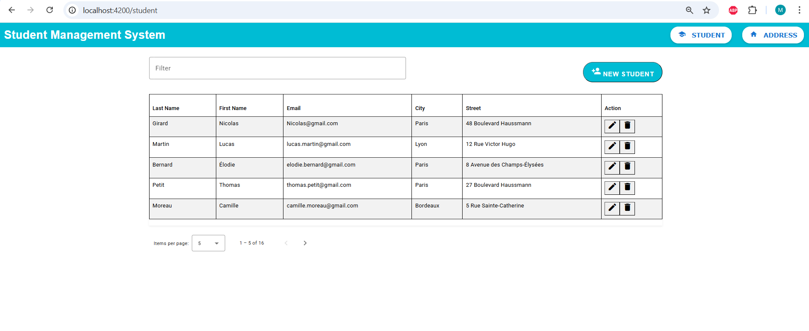

### 📄 Students With Pagination
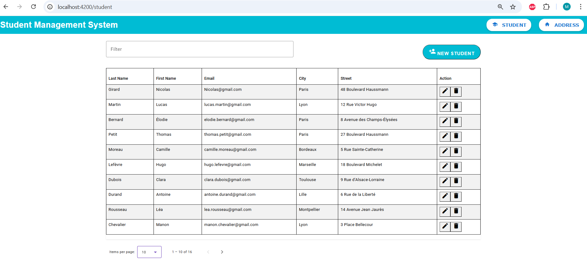

### ➕ Add Student (Mathieu Example)
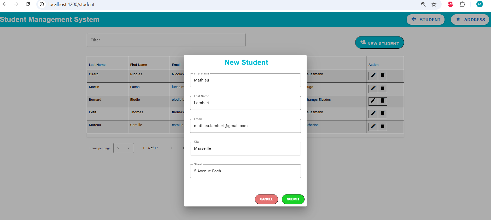

### ✅ Student Added
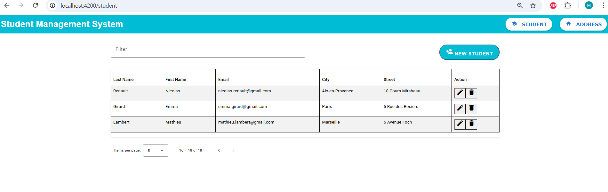

### ➕ Student Address Added
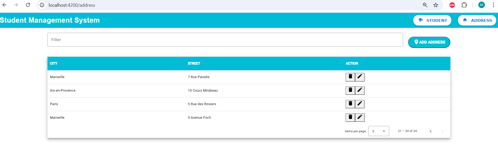

### 🗑 Delete Student Dialog
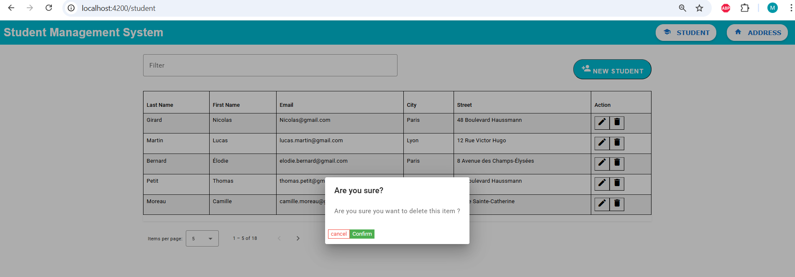

### 🗑 Student Deleted
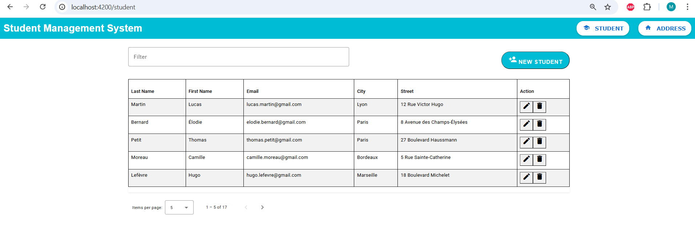

---

### 🏠 Addresses Page

### 📄 Addresses With Pagination
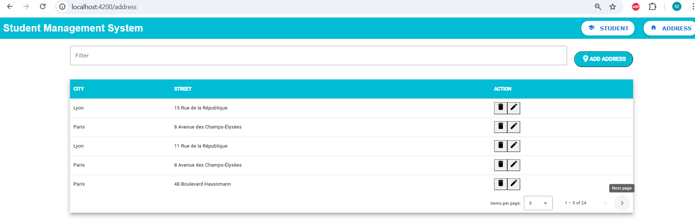

### ➕ Add New Address
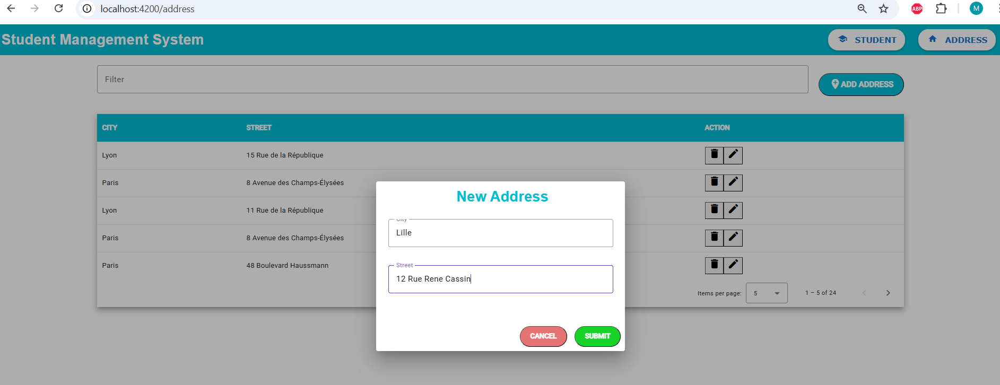

### ✅ Address Added Successfully
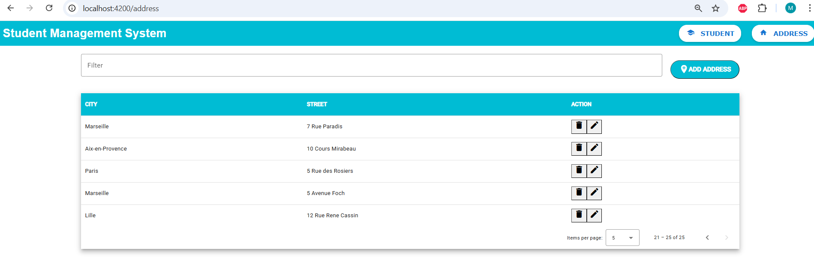

### ✏ Update Address Dialog
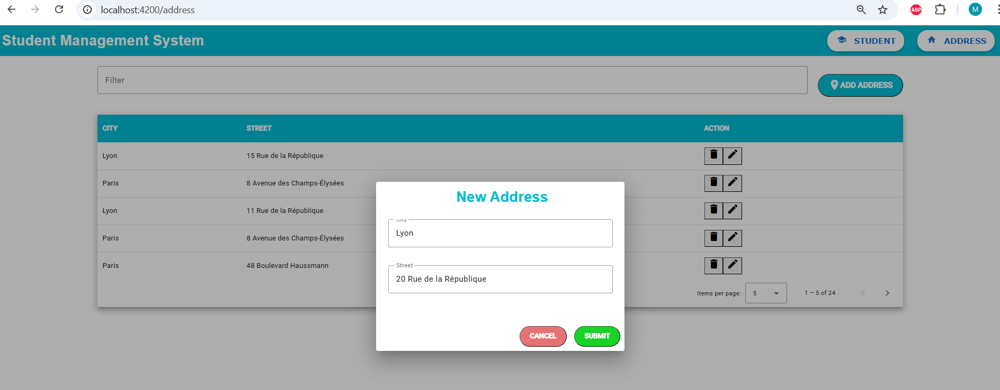

### ✅ Address Updated
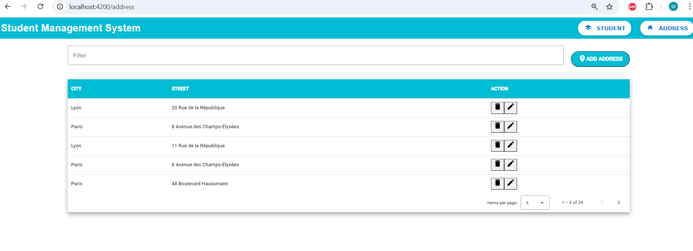

### 🗑 Delete Address Dialog
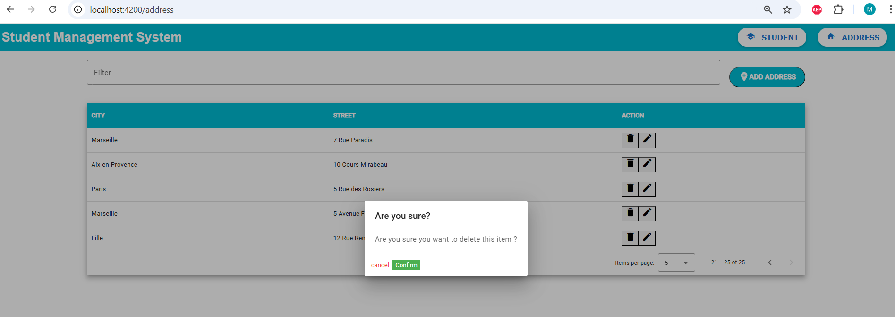

### 🗑 Address Deleted
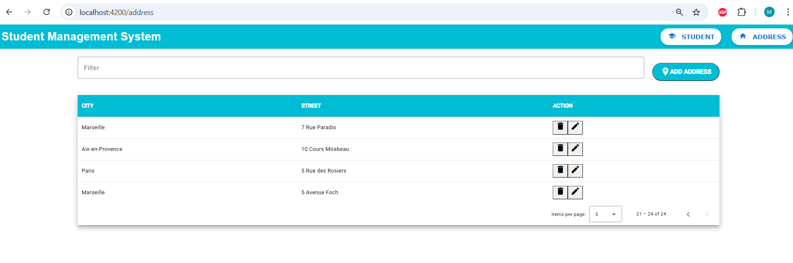

---

### 🧭 Eureka Dashboard
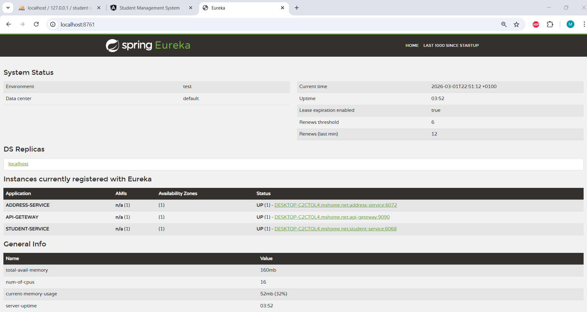

### 🔎 Filter Students
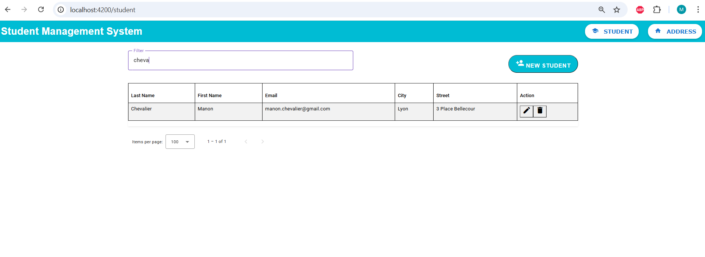

### 🔎 Filter Addresses
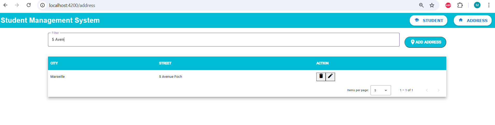